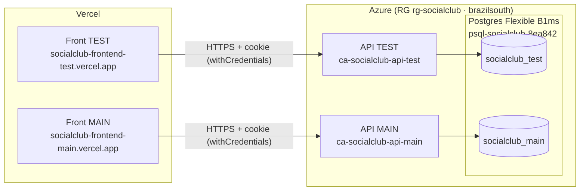

# SocialClub — Infraestructura y despliegue

> Documento de referencia con **todas las decisiones de infraestructura y despliegue** del proyecto SocialClub. Aplica a los dos repos (`socialclub-backend` y `socialclub-frontend`). Última actualización: 2026-08-07.

---

## 1. Panorama general

Dos entornos independientes y paralelos: **test** y **main** (producción). Cada uno = frontend (Vercel) + API (Azure Container Apps) + base de datos (Azure PostgreSQL).



**Mapa rama → entorno** (Git Flow: `feature/* → dev → test → main`):

| Rama | Front (Vercel) | API (Azure) | Base de datos | Deploy |
|---|---|---|---|---|
| `dev` | — (solo CI) | — | — | Solo corre CI (lint+test+build) |
| `test` | socialclub-frontend-test | ca-socialclub-api-test | socialclub_test | **Automático** en push |
| `main` | socialclub-frontend-main | ca-socialclub-api-main | socialclub_main | Automático **con aprobación manual** |

**URLs productivas**

| | TEST | MAIN |
|---|---|---|
| Front | https://socialclub-frontend-test.vercel.app | https://socialclub-frontend-main.vercel.app |
| API | https://ca-socialclub-api-test.agreeablehill-d095161e.brazilsouth.azurecontainerapps.io/api/v1 | https://ca-socialclub-api-main.agreeablehill-d095161e.brazilsouth.azurecontainerapps.io/api/v1 |

---

## 2. Decisiones clave (y por qué)

| Decisión | Elección | Motivo |
|---|---|---|
| Hosting API | **Azure Container Apps** (escala a cero) | Cuota gratuita generosa; escala-a-cero para no gastar crédito de estudiante. Corre la imagen Docker `prod`. |
| Base de datos | **1 servidor Postgres Flexible B1ms + 2 bases** | Más barato que 2 servidores; se aísla por base (`socialclub_test` / `socialclub_main`). |
| Registro de imágenes | **ghcr.io** (GitHub Container Registry) | Gratis, integrado con Actions. Se evita el costo de Azure Container Registry. |
| Hosting Front | **Vercel** (2 proyectos) | Free tier suficiente para SPA; build por entorno con su `VITE_API_URL`. |
| Auth GitHub → Azure | **OIDC (federated credentials)** | Sin secretos de larga vida en el repo; tokens efímeros por deploy. |
| Cookie de sesión | **`SameSite=None; Secure`** en prod | Front y API viven en dominios distintos (Vercel ↔ Azure) → la cookie debe ser cross-site. |
| Aprobación a producción | **Manual** (GitHub Environment `production` con reviewer) | Evita deploys accidentales a main. |
| Región | **Brazil South** | La más cercana a Argentina; soporta Container Apps + Postgres B1ms. |

---

## 3. Azure

- **Subscription:** `Azure for Students` (tenant `frvm.utn.edu.ar`). Usuario Owner de la subscription.
- **Resource Group:** `rg-socialclub` · región `brazilsouth`.
- **Resource providers** registrados: `Microsoft.App`, `Microsoft.DBforPostgreSQL`, `Microsoft.OperationalInsights`.

### 3.1 PostgreSQL

- **Servidor:** `psql-socialclub-8ea842` (Flexible Server, tier Burstable **B1ms**, PostgreSQL **16**, 32 GB, usuario admin `scadmin`).
- **Bases:** `socialclub_test`, `socialclub_main`.
- **Firewall:** regla `AllowAzureServices` (0.0.0.0, permite recursos de Azure incl. Container Apps) + `DevTemp-lucas` (IP de desarrollo temporal, **se puede borrar**).
- **Conexión:** `DATABASE_URL` exige `?sslmode=require`.

### 3.2 Container Apps

- **Environment:** `cae-socialclub`.
- **Apps:** `ca-socialclub-api-test`, `ca-socialclub-api-main`.
- **Config:** `--target-port 3000`, `--ingress external`, `--min-replicas 0 --max-replicas 1`, `0.5 CPU / 1.0 Gi`.
- **Imagen:** `ghcr.io/lucasgazzola/socialclub-backend` (tags `test` / `test-<sha>` y `main` / `main-<sha>`). El package es **público** y está vinculado al repo (Actions lo administra).

### 3.3 OIDC (autenticación de GitHub Actions a Azure)

- **App Registration:** `socialclub-github-oidc` (appId `b83ab397-4b20-4e6b-b0da-0005710dfd30`) + Service Principal.
- **Rol:** `Contributor` sobre `rg-socialclub`.
- **Federated credentials:** subjects `repo:lucasgazzola/socialclub-backend:environment:test` y `:environment:production`.

---

## 4. Imagen Docker de producción (backend)

La imagen `prod` (multi-stage: `base → deps → build → prod`) corre como usuario no-root y su **entrypoint aplica migraciones + seed en cada arranque**:

```
prisma generate → prisma migrate deploy → node prisma/seed.js → node dist/main
```

> ⚠️ **La imagen `prod` requirió arreglos** para poder desplegar (nunca se había ejecutado; compose usa el target `dev`):
> - `prisma` movido a `dependencies` (sobrevive a `npm prune --omit=dev`; necesario para `migrate deploy` en runtime).
> - Seed **precompilado a JS** (`npm run build:seed`) y ejecutado con `node prisma/seed.js` — se sacó `ts-node` del runtime (fallaba con TypeScript 6). En dev se mantiene el fallback a ts-node.
> - `tsconfig.build.json`: excluye `prisma/` y fija `rootDir: ./src` para que el build emita `dist/main.js`.

---

## 5. Variables de entorno y secretos

### 5.1 Backend (Container App)

| Variable | Origen | Notas |
|---|---|---|
| `NODE_ENV` | env-var (`production`) | Activa cookie `Secure` / `SameSite=None` (test y main) |
| `PORT` | env-var (`3000`) | |
| `JWT_EXPIRES_IN` | env-var (`8h`) | |
| `SWAGGER_ENABLED` | env-var (`true` en test, `false` en main) | Expone `/api/docs`. Visible en todos los entornos **menos prod (main)**. Por defecto: on fuera de `production`. |
| `CORS_ORIGIN` | env-var | URL exacta del front del entorno (sin barra final) |
| `SEED_ADMIN_EMAIL` | env-var (`admin@socialclub.local`) | |
| `DATABASE_URL` | **secret** (`secretref:database-url`) | Con `?sslmode=require` |
| `JWT_SECRET` | **secret** (`secretref:jwt-secret`) | Distinto por entorno |
| `SEED_ADMIN_PASSWORD` | **secret** (`secretref:seed-admin-password`) | Distinta por entorno |

### 5.2 GitHub Environments (`test` y `production`)

Secrets cargados en cada environment (los consume el CD): `AZURE_CLIENT_ID`, `AZURE_TENANT_ID`, `AZURE_SUBSCRIPTION_ID`, `DATABASE_URL`, `JWT_SECRET`, `CORS_ORIGIN`, `SEED_ADMIN_EMAIL`, `SEED_ADMIN_PASSWORD`.

> Los valores reales (JWT, DB, passwords) viven en **Azure Container App secrets** y **GitHub Environment secrets**. No están en el repo.
>
> **Referencia local:** `.env.example` documenta las variables (sin valores reales). El detalle de todas las credenciales está en `CREDENCIALES.md` (**gitignoreado**, no se commitea).

### 5.3 Frontend (Vercel, build-time)

| Variable | Valor |
|---|---|
| `VITE_API_URL` | URL `/api/v1` de la API del entorno (build-time; un valor por proyecto) |

---

## 6. CI/CD (GitHub Actions)

Workflows en `.github/workflows/` del backend:

- **`ci.yml`** — en PRs a `dev`/`test`/`main` y push a `dev`: `npm ci` → `prisma generate` → lint → test → build. **No despliega.**
- **`cd-test.yml`** — en push a `test`: build imagen (`target prod`) → push a ghcr → login OIDC a Azure → crea/actualiza `ca-socialclub-api-test`.
- **`cd-main.yml`** — en push a `main`: idem, `environment: production` (**requiere aprobación manual**).

Detalles: usan `docker/setup-buildx-action` (driver `docker-container`, necesario para cache `type=gha`); autenticación a ghcr con `GITHUB_TOKEN`; a Azure con OIDC. Migraciones y seed se aplican solos vía entrypoint.

El frontend se despliega por la **integración nativa Git de Vercel** (no usa Actions): cada push a la rama de producción de cada proyecto dispara un build+deploy.

---

## 7. Runbook (operaciones comunes)

```bash
# Ver estado / logs de una API
az containerapp show -g rg-socialclub -n ca-socialclub-api-test -o table
az containerapp logs show -g rg-socialclub -n ca-socialclub-api-test --follow

# Desplegar a TEST: merge/push a la rama test (CD automático)
git push origin dev:test           # backend y front

# Desplegar a MAIN: push a main y aprobar en GitHub Actions (Review deployments)

# Actualizar un secreto de la API (ej. CORS_ORIGIN)
az containerapp update -g rg-socialclub -n ca-socialclub-api-test \
  --set-env-vars "CORS_ORIGIN=https://socialclub-frontend-test.vercel.app"

# Rotar un secreto sensible (DATABASE_URL / JWT_SECRET): actualizar el GitHub
# Environment secret y volver a desplegar (el CD lo re-aplica).
```

Healthcheck: `GET /api/v1/health`. Login inicial: `admin@socialclub.local` (password por entorno, definida como secret del seed).

---

## 8. Pendientes / notas conocidas

- **Cold start ejecuta migrate + seed** en cada arranque desde cero (idempotente, pero suma latencia). Aceptable para este proyecto.
- **El seed loguea la contraseña del admin** en stdout → queda en logs del contenedor en prod. Conviene condicionarlo a no-producción.
- **Regla firewall `DevTemp-lucas`** (IP de desarrollo) puede borrarse cuando no se necesite acceso directo a la DB.
- **Credencial de registry en las Container Apps:** ya no es imprescindible (el package ghcr es público); se puede remover.
- El acceso a la DB desde las Container Apps usa la regla "Azure services" (0.0.0.0). Para mayor aislamiento podría usarse VNet/private endpoint (no necesario en este alcance).
